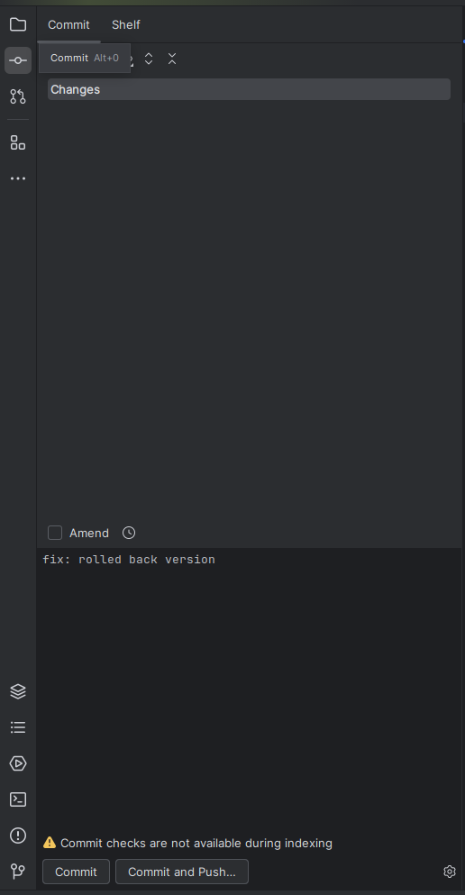
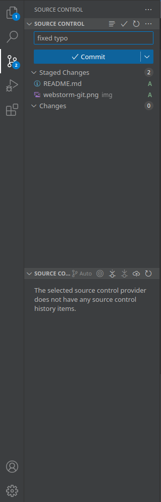

# HTML alapok

## Bevezetés

A HTML adja egy weboldal vázát. Ez egy fa struktúrában jelenik meg. Ezekről [itt](https://www.w3schools.com/html/) nagyon sokat olvashatsz.

Alap esetben ezek a tagek két félék lehetnek:
- Párosak: `<tag>tartalom</tag>`
- Páratlanok: ``, vagy `` 

Látható hogy a tagek nevét kacsacsörök közé kell tenni, a párosaknál a záró neve elé pedig egy `/` kerül.

Ha a tag páros, a nyitő és a záró rész közé kerülhet tartalom,

Az egyes tageknek vannak attribútumai:

```
<tag attr1 attr2="value">
```

Ezen attribútumoknak lehetnek értékei is, ezt egy egyenlőségjel után lehet megadni.

Ha valamelyik kódrészletet nem akarjuk, hogy értelmezve legyen, kikommentezhetjük azt, vagy akár megjegyzéseket is írhatunk (és ajánlott hogy írjunk), hogy érthetőbb legyen mire is gondolt a költő:

```
<!-- komment -->
<nem komment>
```

## Egy konkrét példa

Az alap fájlnév `index.html` ez mindig a home.


```html
<!DOCTYPE html> <!-- Ez csak egy header ami megadja a böngészőnek, hogy miféle kódot kell feldolgoznia -->
<html lang="hu"> <!-- A gyökér elem, ennek a gyereke (tartalma) minden más. Az attribútum pedig megadja az oldal tartalmának nyelvét. Ezt nem kötelező megadni, de a böngészők és keresőmotorok számára hasznos információ tud lenni -->
<head> <!-- A head olyan elemeket tartalmaz, amik nem jelennek meg közvetlenűl a weboldalon, hanem a böngésző és a keresőmotorok számára szolgálnak információval-->
    <!-- A meta tagek a keresőmotor számára szolgálnak információra, google keresésekkor tűnhet fel az összefoglaló szövegek innen kerülnek ki -->
    <meta charset="UTF-8"> <!-- Na mondjuk ez pont a böngészőnek szól, a karakterkódolást határozza meg de nem kötelező -->
    <meta name="author" content="Chat GPT"/> <!-- Itt meg lehet adni az oldal szerzőjét -->
    <meta name="description" content="A legfrissebb hírek"/> <!-- Itt meg lehet adni az oldal leírását -->
    <meta name="keywords" content="webtervezés,webterv,HTML,CSS,PHP"/> <!-- Szerintem ez már egyértelmű -->
    <title>Page Title</title> <!-- Ez a tabon megjelenő cím -->
    <link rel="icon" href="icon.png"/> <!-- Itt megadhatod a tabon megjelenő ikon linkjét, ez egy relatív útvonal, ezekről lejjebb részletesen kerül szó -->
</head>
<body>
    <!-- Címek - minél nagyobb a szám, annál kisebb szintű cím -->

    <h1>Főcím</h1>
    <h2>Alcím</h2>
    <h3>Alabbcím</h3>
    <h4>Alabbcím</h4>
    <h5 id="header5">Annál is alabbcím</h5> <!-- Az idnek most még nincs jelentősége, egy abszolút elhagyható elem, majd később lesz részletezve -->
    <h6>Legalabbcím</h6>

    <p>Ez pedig egy bekezdés</p>

    <!-- Kép beszúrása -->
    
    

    <br> <!-- br = sortörés -->

    <!-- Linkek -->

    <!-- weboldal -->
    <a href="https://www.youtube.com">Link</a><br>

    <!-- file megnyitása -->
    <a href="../img/vs-code-git.png">File linkként</a><br>

    <!-- fileon belül id alapján -->
    <a href="#header5">Ugrás az annál is alabbcímhez</a><br>

    <!-- egyéb link attribútumok -->
    <a href="https://www.youtube.com" target="_self">Link ezen az oldalon (default)</a><br>
    <a href="https://www.youtube.com" target="_blank">Link új oldaon</a><br>
    <a href="https://www.youtube.com" title="cím">Link címmel</a><br>
    <br>
    <br>
    <br>
</body>
</html>
```

Ugyan ezt megtalálod az index.html-ben is,

### Képek

- `src` -> a kép elérési útvonala  
- `alt` -> ha nem tud megjelenni a kép ez a szöveg fog látszani, látássérülteknek is segítség
- `title` -> ha a kép felé húzod az egeret megjelenik
- `width` és `height` -> a kép szélessége és magassága, ha csak az egyiket adod meg, akkor a másik automatikusan igadozik az eredeti méretarányhoz


### Linkek

- `href` -> az elérési útvonal, lehet
    - webcim (http://-el vagy https://-el kell kezdeni ha konkrét weboldalról van szó, ha egy másik html file, akkor lehet relatív útvonalat megadni
    - fájl - ezt fogja megjeleníteni, vagy letölteni
    - rész a weboldalon belül - ha egy elemnek vani id-je, akkor a `#tagid` oda fog mutatni, rákattintáskor odagörget az oldal
- `title` -> ha a kép felé húzod az egeret megjelenik
- `target` -> link megnyitásának módja:
    - `_self` -> ugyan abban a tabbban (default)
    - `_blank` -> új tabon

## Relatív vs Abszolút útvonal röviden

Abszolút: mindenhonnan ugyan oda vezet:

```
C:\users\rostasszabika\music\vettem-a-piacon.mp3
```

Lokálisnak célszerűnek tűnhet, hogy bárhova pakolva jó helyre mutat, de nem célszerű használni, mert másik számítógépen nem fog működni.

Helyette tfh a következő file struktúrával rendelkezünk:

```
rostasszabika
|-documents
| |-index.html
| |-szajkosar.jpg
|-downloads
| |-szajkosar
| | |-webshop.html
|-music
| |-vettem-a-pacon.mp3
```

Ha az indexből akarjuk elérni a `szajkosar.jpg`-t:

```
./szajkosar.jpg
```

vagy 

```
szajkosar.jpg
```

`.` - a jelenlegi könyvtárra utal, de nem feltétlenül szükséges kitenni, hiszen alapesetben is ott fogja keresni.

Ha a `vettem-a-piacon.mp3`-at:

```
../music/vettem-a-piacon.mp3
```

`..` - az egyel kívülebbi könyvtárra utal - az index a documents mappában található, innen ki kell jutnunk a rostasszabikába és onnan a musicba.

Ha a webshopból próbáljuk elérni:

```
../../music/vettem-a-piacon.mp3
```

